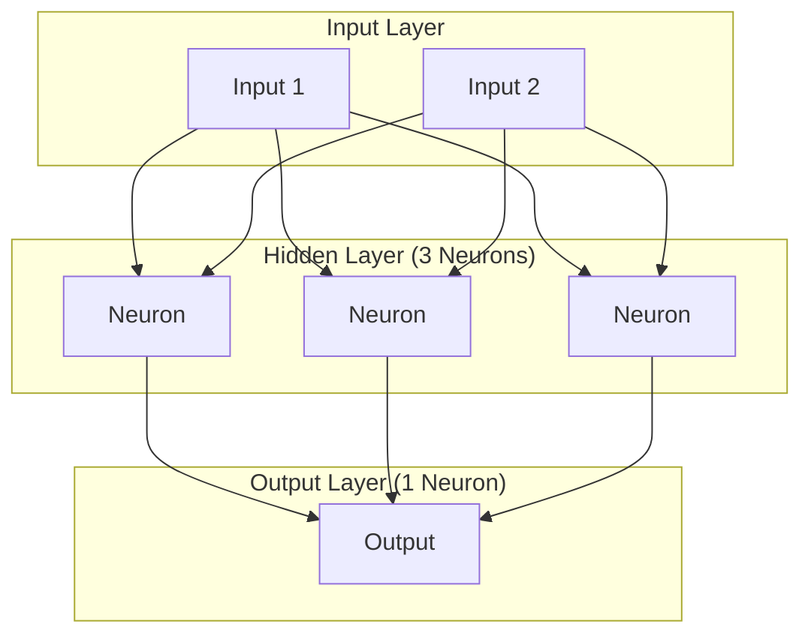
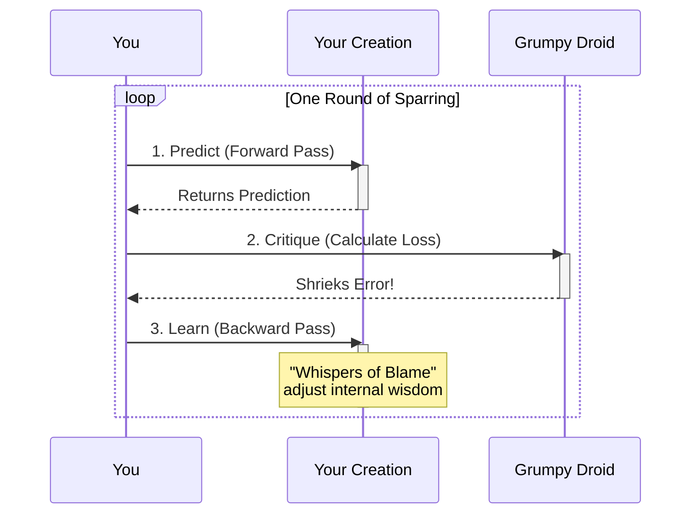

# The Path of the Python Padawan: A Neural Network Saga

Welcome, young apprentice, to our secret AI-dojo. You have been chosen for a quest of profound importance: to build a thinking machine from scratch. Many see this as an impossible task, an art shrouded in the dark magic of impenetrable calculus. But you will learn the truth. It is not magic, but the Force—an elegant, logical flow of information that you will learn to command.

In this repository lies a single Python scroll, `neural_network.py`. It is the blueprint for a mind. This document, your holocron, will be your guide on the path to understanding it. We will not just read the incantations; we will understand the story they tell.

Our saga is centered on a legendary trial: teaching our creation to solve the puzzle of XOR.

---

### Chapter 1: The Legend of the Unsolvable Puzzle

Every great quest needs a dragon to slay. Ours is a deceptively simple beast of logic known as **XOR (Exclusive OR)**.

Its rules are simple:

- If two inputs are the **same** (both `0` or both `1`), the output is `0`.
- If two inputs are **different** (one `0` and one `1`), the output is `1`.

| Input 1 | Input 2 | Output |
| :-----: | :-----: | :----: |
|    0    |    0    | **0**  |
|    0    |    1    | **1**  |
|    1    |    0    | **1**  |
|    1    |    1    | **0**  |

This puzzle, while trivial for a child, was a gatekeeper in the history of AI. The first neural networks, the ancient Perceptrons, were powerless against it. They could only see the world in straight lines, and the XOR pattern cannot be solved with a single line. This failure nearly ended the age of AI before it began.

The solution required a leap of imagination: a network with a "hidden layer" of neurons, capable of seeing a deeper reality. By conquering XOR, we are reliving one of the great triumphs of AI history. This is the beast we are here to tame.

---

### Chapter 2: Forging the Crystal Heart

A thinking machine, like a Jedi's lightsaber, must be built, not found. We start with its heart: the `Layer`.

Think of a `Layer` as a council of neuron-sages, a unified crystal that hums with potential. It is defined by its `weights` (its collective wisdom) and its `biases` (its inherent inclinations). When a signal enters, the `Layer` consults its wisdom and inclinations to produce a new signal. This is its "thought," a single step in a larger process.

We then house these layers within the `NeuralNetwork`—the temple itself. The network orchestrates the flow of thought, passing a signal from one layer to the next in a grand cascade known as the **Forward Pass**.

Our temple for the XOR quest has a simple, elegant design: 2 inputs, a hidden council of 3 neurons, and 1 final output neuron to declare the answer.



---

### Chapter 3: The Art of a Learning Mind

Our creation can now think, but it cannot learn. It is a blade without a wielder. To learn, it must first recognize its own failures.

For this, we summon the **Loss Function**, a grumpy but honest training droid. It compares the network's thoughts to the actual truth and shrieks a number—the "loss." The louder the shriek, the greater the failure. The entire goal of training is to soothe this droid into silence.

But how? How does the network learn from the droid's critique?

It learns through the sacred art of **Backpropagation**. This is the most mystical part of our journey. Backpropagation is the art of listening to the Force. The loss is a disturbance, and backpropagation traces that disturbance _backward_ through the temple, from the final thought all the way to the first neuron. It's a chain of "whispers of blame," where every single weight and bias in the network is told exactly how it contributed to the final mistake, and precisely how to change to do better next time. This is how wisdom is gained.

---

### Chapter 4: The Dojo of Endless Practice

With the ability to learn, our network must now be trained. We build a **Training Dojo**, the `train` method. Here, the network spars against the training data for thousands of rounds (`epochs`).

The sacred rhythm of the dojo is a three-step dance: Predict, Critique, and Learn. This cycle repeats, endlessly honing the network's skill.



In each round, it performs the sacred rhythm:

1.  **Predict**: It faces an opponent (a data sample) and makes a prediction.
2.  **Critique**: The grumpy droid shrieks out the loss.
3.  **Learn**: The whispers of blame flow backward, and the network adjusts its form.

We watch as the droid's shrieks grow quieter and quieter. The network is learning. It is getting stronger.

---

### Chapter 5: The Awakening

The training is complete. The time has come for the final trial: to face the XOR beast. We present the puzzle to our newly trained network. It takes a breath, channels its accumulated wisdom, and... succeeds.

```
Let's see the wisdom it has gained:
Input: [0 0], Prediction: 0.0466, Actual: 0
Input: [0 1], Prediction: 0.9456, Actual: 1
Input: [1 0], Prediction: 0.9585, Actual: 1
Input: [1 1], Prediction: 0.0393, Actual: 0
```

Victory! The beast is tamed. The puzzle is solved. Our creation, once an empty vessel, can now perceive a deeper truth.

---

### Your Journey Begins Now

This saga is now yours to command. To awaken your own network, follow these steps:

1.  **Install `uv`**: If you do not have it, `uv` is a swift and powerful packaging tool. Follow the official instructions to install it.

2.  **Create the Virtual Environment**: Open your terminal and create the sacred ground for your project:

    ```bash
    uv venv
    ```

3.  **Install Dependencies**: Summon the `numpy` crystal into your environment:

    ```bash
    uv pip install numpy
    ```

4.  **Run the Scroll**: Unleash the power of the script:
    ```bash
    .venv/bin/python neural_network.py
    ```

May the Force be with you on your journey.
