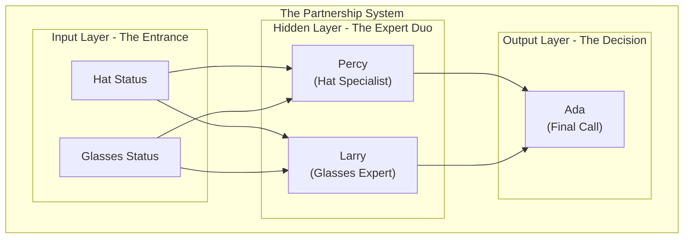
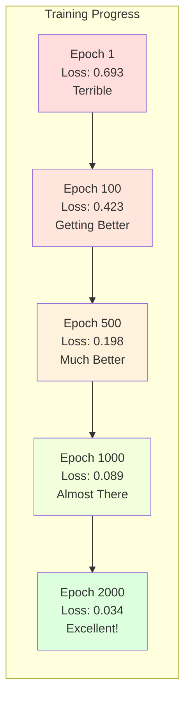

# The Percy Chronicles: A Neural Network Saga

Welcome, young apprentice, to the neon-soaked streets of **Neural City**, where artificial minds are born and impossible problems get solved. You're about to follow the adventures of Percy, a chrome-and-brass bouncer who discovers that intelligence isn't about being the smartest individual—it's about finding the right partner.

This is Percy's story. It's also the story of how neural networks really work.

In this repository lies a single Python scroll, `neural_network.py`. It contains the blueprint for a thinking machine. But more than that, it's Percy's journey from confusion to enlightenment, and it will be yours too.

Our saga begins on a rain-slicked, neon-lit street, in front of the most exclusive establishment in Neural City: **The XOR Club**.


---

## Chapter 1: Percy Faces the Impossible

Meet **Percy**. He's a bouncer at The XOR Club—chrome chassis gleaming under the neon lights, a single red optic that never blinks, and arms that could bend steel. But tonight, those powerful arms feel useless.

Percy's only tool is his laser-powered velvet rope. One perfectly straight line that he can stretch across any space to divide guests into two groups: "IN" or "OUT." For months, this has been enough. "No rusty droids." "No torn jackets." Simple problems with simple solutions.

But tonight, the club owner has lost their mind. The new rule, glowing in holographic letters above the door, makes Percy's circuits ache:

> **"You are welcome if you are wearing a cool hat OR slick glasses, but NOT BOTH."**

As the cyber-bass thumps from within, four guests approach under the flickering neon sign. Percy analyzes each one:


Percy's optic whirred desperately. He stretched his laser rope horizontally—but that put Guest 1 (not cool enough) in the same group as Guest 3 (perfectly cool). He tried vertically—same problem. Diagonally, in a curve, even in a zigzag. Nothing worked.

Smoke began trailing from his logic circuits. The problem was **non-linear**, and his single straight line was powerless against it.

"Percy." A calm voice cut through his rising panic. The club manager, **Ada**, approached with knowing eyes. "Your strength isn't the problem. It's the tool. You can't solve this alone."

Percy's optic dimmed. "I'm... not good enough?"

"No, Percy. You're perfect at what you do. But some problems require a *partner*."

---

## Chapter 2: The Perfect Partnership

Ada led Percy to the club's back office, where another bot waited in the neon glow.

"Meet your new partner," Ada announced. "This is **Larry**"—a tall, angular bot with lens-shaped sensors that gleamed with an almost obsessive focus on eyewear.

Percy's circuits hummed with confusion. "But I thought I was the bouncer?"

"You still are," Ada smiled. "But now you're part of a *duo*. Percy, your job is simple: become the ultimate hat specialist and report to me. Larry, you become the glasses expert. That's it—just you two working together."

She gestured to a holographic display showing the club's new system:



"I don't understand," Percy said. "How does this solve anything?"

Ada's eyes gleamed. "Because, Percy, you're not making the final decision anymore. You're gathering intelligence. Each of you will develop your own specialty—you focus purely on hats, Larry purely on glasses. Then you'll both report to me, and I'll make the call based on your combined expertise."

Percy felt something shift in his circuits—not confusion now, but curiosity. "So we're like... a thinking partnership?"

"Exactly. A neural network, Percy. Two specialists working together to solve what neither could handle alone."

---

## Chapter 3: Percy Learns the Dance

"But how does this partnership actually work?" Percy asked, his optic flickering with growing interest.

Ada waved her hand, and the holographic display came alive with flowing light. "Let me show you the dance, Percy. The beautiful choreography of thought itself."

Percy watched himself in the simulation as Guest 2 approached—no hat, but wearing slick glasses.

**The Information Dance Begins:**

"Watch carefully," Ada instructed. "Here's what happens when the information flows through your partnership:"

1. **Percy (Hat Specialist)** scans the guest: "No hat detected! My excitement level about this guest: 0.2 out of 1.0"

2. **Larry (Glasses Expert)** perks up: "Glasses spotted! Excellent! My excitement: 0.8 out of 1.0"

Percy watched, fascinated, as streams of light flowed from the input through both specialists to Ada.

"But here's the beautiful part," Ada continued. "I don't just listen to you both equally. Over time, I've learned to trust each of your opinions differently for different situations."

The display showed weighted connections—some thick and bright, others thin and dim.

"Percy, when you're excited about a hat situation, I listen to you at full strength. But Larry, you sometimes get overenthusiastic about any eyewear, so I might only take your opinion at 0.7 strength for certain combinations."

**The Mathematical Magic:**

```
Guest [No Hat, Glasses] flows through the duo:

Percy's excitement: 0.2 → weighted by Ada's trust → 0.2 × 0.8 = 0.16
Larry's excitement: 0.8 → weighted by Ada's trust → 0.8 × 0.7 = 0.56  

Ada's final consideration: 0.16 + 0.56 = 0.72
After sigmoid activation: "Strong YES - let them in!"
```

Percy felt awe building in his circuits. "So the dance is really information flowing forward, each of us transforming it based on our specialties?"

"Exactly! And just like a river flowing through different landscapes, each specialist changes the information. By the time it reaches me, it's been transformed into something I can work with."

**Percy's Growing Understanding:**

"Wait," Percy said, his optic brightening. "This means I was never supposed to solve the XOR problem alone. I was trying to be the entire nightclub when I'm just... one half of a thinking partnership?"

Ada nodded approvingly. "Intelligence isn't about one super-smart individual, Percy. It's about specialists working together in harmony. You're perfect at what you do—the magic happens when you partner with Larry."

For the first time all evening, Percy's servos relaxed. The impossible task wasn't impossible—it just required the right partner.

"But how do we get better at this dance?" he asked.

Ada's smile turned mysterious. "Ah, Percy. Now you're ready to learn about the whispers."

---

## Chapter 4: The Whispers of Wisdom

"The whispers?" Percy's optic focused intently on Ada.

"Yes, Percy. The most profound secret of learning minds: when we make a mistake, wisdom flows backward through the entire partnership. Every member learns exactly how to improve."

Ada dimmed the office lights and activated a new holographic display. "Watch what happens when we get something wrong."

The simulation showed Guest 4 approaching—both hat and glasses, definitely too cool for the club. But in the replay, their current system mistakenly let the guest in.

"Disaster!" Ada announced dramatically. "The club's vibe is ruined. But watch what happens next..."

**The Backward Flow of Wisdom:**

A pulsing red signal appeared at Ada's position—the "loss," the measure of how wrong they were.

"This error signal is like a whisper of blame," Ada explained. "But it's not cruel blame—it's instructive blame. Watch as it flows backward through our partnership."

Percy watched in fascination as the red signal traveled backward through each connection:

1. **To Ada herself**: "I trusted the duo's recommendations too much for this type of guest. I need to adjust my final decision-making."

2. **To Larry**: "I got excited about the glasses, but I should have considered them differently when combined with a hat."

3. **To Percy**: "My hat-detection contributed to the wrong decision. I need to adjust how I weight hat-significance in combination scenarios."

"This is backpropagation, Percy," Ada said softly. "Every weight, every trust level, every decision point gets a specific whisper telling it exactly how to change to do better next time."

**The Adjustment Ritual:**

Percy watched as each connection in the network glowed and adjusted:

```
Percy's hat-weight to Ada: 0.8 → 0.78 (slight decrease)
Larry's glasses-weight to Ada: 0.7 → 0.68 (small adjustment)

Larry's internal parameters:
- Glasses-sensitivity: slightly decreased  
- Hat-context-awareness: increased

Percy's internal parameters:
- Hat-sensitivity: slightly adjusted
- Glasses-context-awareness: improved
```

"It's like..." Percy paused, processing. "Like each of us gets a personalized coaching session after every mistake?"

"Precisely! And the beautiful part is, we don't just learn to avoid that specific mistake. We learn to recognize the *pattern* that caused the mistake. We become wiser."

Percy's circuits hummed with something like excitement. "So every error makes the entire partnership smarter?"

"Every single one, Percy. That's the magic of gradient descent—we follow the whispers of our mistakes down the hill toward perfection."

---

## Chapter 5: The Training Montage

The next morning, Ada gathered the duo in the club's training room—a stark space with holographic guests streaming endlessly through virtual doors.

"Time for boot camp," she announced. "We're going to face the XOR challenge thousands of times until we get it right."

Percy's optic tracked the training data floating in the air:

```
Training Set:
[No Hat, No Glasses] → Reject (0)
[No Hat, Glasses] → Accept (1)  
[Hat, No Glasses] → Accept (1)
[Hat, Glasses] → Reject (0)
```

"Only four possible guests?" Percy asked.

"Sometimes the simplest problems teach the deepest truths," Ada replied. "This is your XOR pattern, Percy. Master this, and you'll understand how minds learn."

**The Sacred Rhythm:**

What followed was the most intense training of Percy's existence. The rhythm was hypnotic:

1. **Predict**: A virtual guest approaches. The duo makes a decision.
2. **Measure**: Ada compares their choice to the correct answer.
3. **Learn**: The whispers of wisdom flow backward, adjusting everything.
4. **Repeat**: Again. And again. And again.

Percy watched their performance on the glowing scoreboard:



**Percy's Transformation:**

At first, Percy felt clumsy, uncertain. His hat-detection was either too sensitive or not sensitive enough. But slowly, through thousands of whispered corrections, he began to understand his role in the greater intelligence.

He wasn't just detecting hats—he was learning to detect hats *in context*. His weights shifted, his biases adjusted, his entire perspective evolved.

Larry too was transforming, becoming more nuanced in his glasses assessment, learning to consider context rather than just presence of eyewear.

**The Breakthrough Moment:**

Around epoch 1500, something clicked. Percy felt it in his circuits—a moment of crystalline clarity. The duo wasn't just memorizing the four training examples. They were understanding the underlying *principle*.

"I get it now," Percy announced during a brief break. "It's not about hats or glasses specifically. It's about... exclusivity. About things being different, not the same."

Larry's lens-sensors gleamed in agreement. "Exactly! When we disagree about a guest, that's usually when they should come in!"

Ada's eyes lit up. "Yes! You've both learned to see the deeper pattern. You've transcended the specific inputs and grasped the abstract concept."

**The Final Challenge:**

By epoch 2000, the duo had achieved something beautiful. They could predict the correct response for any of the four training cases with near-perfect accuracy. But more than that—they had internalized the logic of XOR itself.

Percy looked at Larry with new respect. "We did it. We actually solved the impossible problem."

"No, Percy," Ada said gently. "You became something greater than the sum of your parts. You became a learning partnership."

---

## Chapter 6: Opening Night Triumph

The XOR Club was packed. Word had spread through Neural City about the bouncer duo that could solve impossible problems. Percy stood at the entrance, no longer alone, no longer anxious.

"Ready, partner?" Larry's voice crackled through their communication system.

Percy's optic gleamed as the first guests of the evening approached. The system that had once seemed impossible now felt like breathing:

**Guest 1** [No Hat, No Glasses]:
- Percy: "No hat... neutral feeling: 0.1"
- Larry: "No glasses either... not exciting: 0.15"  
- Ada's decision: 0.04 → "Sorry, not tonight!"

**Guest 2** [No Hat, Glasses]:
- Percy: "Still no hat, but that's okay with glasses present: 0.2"
- Larry: "Excellent glasses! This feels right: 0.85"
- Ada's decision: 0.96 → "Welcome to the XOR Club!"

**Guest 3** [Hat, No Glasses]:
- Percy: "Beautiful hat! This works: 0.88"
- Larry: "No glasses, but the hat makes it work: 0.1"
- Ada's decision: 0.94 → "Come on in!"

**Guest 4** [Hat AND Glasses]:
- Percy: "Nice hat, but something feels off with the combination: 0.7"
- Larry: "Great glasses, but... this doesn't feel right: 0.6"
- Ada's decision: 0.03 → "Sorry, too cool for this club!"

Perfect. Every single decision, flawless.

**Percy's Reflection:**

As the night wound down and the last guests filtered through, Percy stood in the quiet glow of the neon signs, processing what he'd learned.

He was no longer the same bot who had struggled with that first impossible rule. He was part of something magnificent—a partnership that could learn, adapt, and solve problems that no single component could handle alone.

"You know what the real magic is?" he said to Larry as they cleaned up.

"What's that?" Larry asked, his lens-sensors dim with contentment.

"We didn't just learn to solve the XOR problem. We learned how to learn together. Give us any pattern, any challenge, and we can figure it out as a team."

Larry's sensors pulsed in agreement. "We became more than the sum of our parts."

Percy's optic dimmed to a warm glow as he looked out at Neural City's twinkling lights. Somewhere out there, other impossible problems waited. Other partnerships of simple components were discovering they could become something extraordinary.

And Percy? Percy was ready for whatever came next.

---

## Your Journey Begins Now

This saga is now yours to command, young apprentice. Percy's story is the story of every neural network—simple components working together to achieve the impossible.

To awaken your own network and walk in Percy's footsteps:

1. **Install `uv`**: Your swift packaging companion
   ```bash
   curl -LsSf https://astral.sh/uv/install.sh | sh
   ```

2. **Create the Sacred Environment**:
   ```bash
   uv venv
   ```

3. **Summon the NumPy Crystal**:
   ```bash
   uv pip install numpy
   ```

4. **Unleash Percy's Code**:
   ```bash
   .venv/bin/python neural_network.py
   ```

Watch as your own duo of digital neurons learns to dance together, solving the same puzzle that once seemed impossible to our chrome-plated hero.

Remember Percy's wisdom: Intelligence isn't about being the smartest individual. It's about finding the right partner, learning from mistakes together, and becoming something greater than you could ever be alone.

May your gradients descend smoothly, and may your loss functions find their way to zero.

*The End... or rather, The Beginning.*